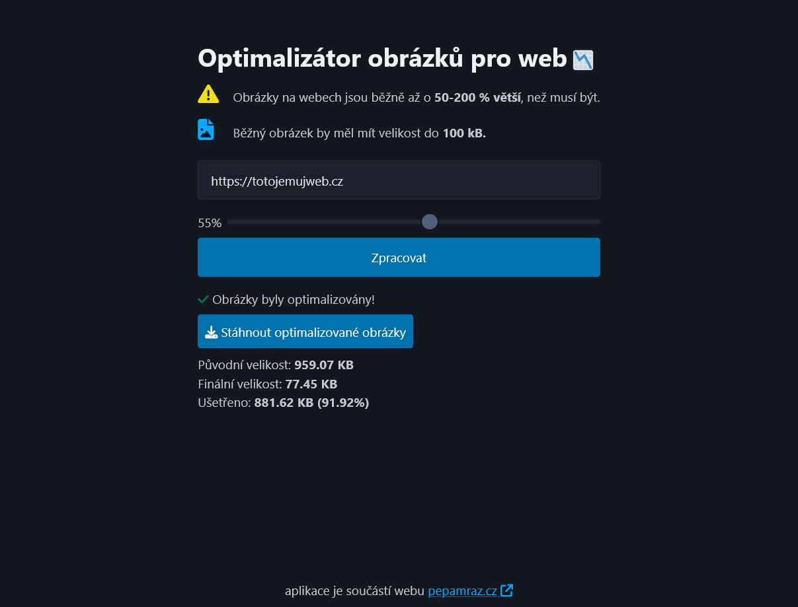

# Optimaliz치tor Obr치zk콢
= je webov치 aplikace pro snadnou optimalizaci velikosti obr치zk콢 na webech. Pom치h치 minimalizovat velikost obr치zk콢 a zrychlit tak na캜칤t치n칤 webov칳ch str치nek.

## 游 Hlavn칤 funkce
- Automatick칠 nalezen칤 obr치zk콢 na webov칠 str치nce
- Mo쬹ost nastavit 칰rove켿 komprese (1-100 %)
- P콏evod obr치zk콢 do form치tu WebP
- Sta쬰n칤 optimalizovan칳ch obr치zk콢 v ZIP

## 游깷 Pou쬴t칤
1. Otev콏ete [img.pepamraz.cz](https://img.pepamraz.cz) nebo index.html na lok치ln칤m xampp serveru v prohl칤쬰캜i.
2. Zadejte URL str치nky na kter칠 chcete obr치zky optimalizovat.
3. Nastavte stupe켿 komprese a spus콘te proces.
4. Po chvilce si m콢쬰te st치hnout ZIP soubor s obr치zky a pod칤vat se kolik m칤sta u코et콏칤te nahr치n칤m t캩chto obr치zk콢.

## 丘뙖잺 Technologie
- HTML, CSS + Pico.css
- JavaScript
- PHP (zpracov치n칤 obr치zk콢, komprese, ZIP)

## 游 Uk치zka aplikace
